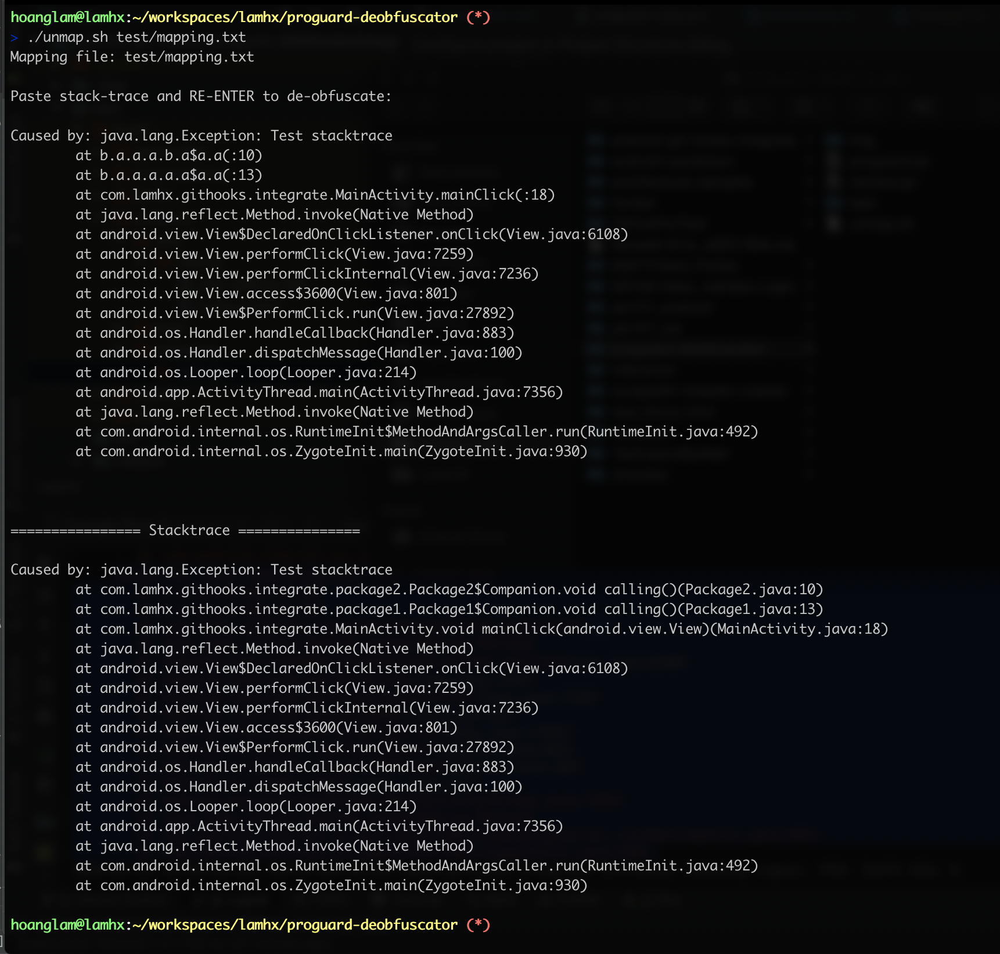

## What is this?
A script to support to quickly `de-obfuscates` stack traces when using ProGuard to minify code.

```txt
    ProGuard is an open source command-line tool that shrinks, optimizes and obfuscates Java code. It is able to optimize bytecode as well as detect and remove unused instructions. ProGuard is open source software.
    Proguard was developed by Eric P.F. Lafortune.
    - Wikipedia
```

The purpose of obfuscation is to reduce your app size and noise your code by shortening the names of your app’s classes, methods, and fields are converted into some random obfuscated names such as a, b, c, etc.<br>
The problem is encounter when some case date with exception raised or crashed and then what goes around comes around.
It's ok, we have Retrace, what is a companion tool for ProGuard that `de-obfuscates` stack traces.<br>
<br>

```shell
    java -jar retrace.jar [options...] mapping_file [stacktrace_file]

    # `stacktrace_file`
    # Optionally specifies the name of the file containing the stack trace. 
    # If no file is specified, a stack trace is read from the standard input. 
    # The stack trace must be encoded with UTF-8 encoding. Blank lines and unrecognized lines are ignored.
```

## Main actor
`unmap.sh` is script `de-obfuscates' stacktrace with deal is supporting blank lines and unrecognized lines.
If no `mapping_file' is specified, the input is `mapping.txt` will be using.<br>
When dating with bug, you just want to instantly clear the stacktrace.<br>
Let a speech dating.<br>
All you need is run script, copy stacktrace and paste into the commandline. This my show.<br>



## 
Happy dating with bugs!